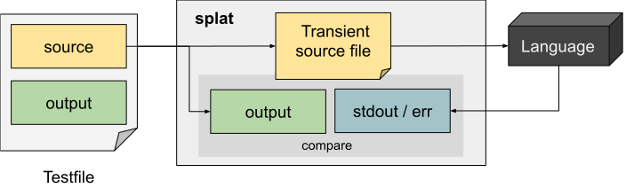

## Design

Splat has a fairly simple high-level design. Any invocation of splat must provide the path to the language implementation 
(which is a black-box to splat), and a path to a testfile.

Source code sections of the testfile are written to transient source-code file on disk (with the extension in `%src-extension`, 
if specified). The language implementation is then called with the path to the transient source file as the only argument - 
which is why implementations that generate an executable (rather than running the program) require a binding script to run 
the executable (see [bind_gcc.sh](examples/bind_gcc.sh) for an example).

Splat considers anything written to stdout and stderror to be output, and does not distinguish between the two when comparing 
against the expected `%output` section of the testfile.

